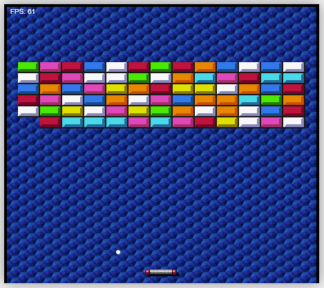

# Arkanoid en JavaScript

¡Bienvenido al proyecto de Arkanoid en JavaScript! Este es un remake del clásico juego de arcade Arkanoid, desarrollado utilizando HTML, CSS y JavaScript.

## Tabla de Contenidos

- [Introducción](#introducción)
- [Características](#características)
- [Instalación](#instalación)
- [Uso](#uso)

## Introducción

Arkanoid es un videojuego arcade desarrollado por Taito en 1986. Este proyecto recrea la experiencia de juego clásica utilizando tecnologías web modernas.

## Características

- Gráficos y animaciones sencillas
- Control de la paleta con el teclado
- Colisiones y detección de rebotes

## Instalación

Sigue estos pasos para ejecutar el proyecto localmente:

1. Clona el repositorio:
    ```sh
    git clone https://github.com/jorgealtamar/arkanoid.git
    ```
2. Navega al directorio del proyecto:
    ```sh
    cd arkanoid
    ```
3. Abre el archivo `index.html` en tu navegador web.

No se requieren dependencias adicionales, ya que todo el código está en HTML, CSS y JavaScript puro.

## Uso

Para jugar a Arkanoid, sigue estas instrucciones:

1. Abre `index.html` en tu navegador.
2. Usa las flechas izquierda y derecha del teclado para mover la paleta.
3. Intenta romper todos los bloques con la bola sin dejar que la bola caiga fuera de la pantalla.

<div align="center">
  
</div>
